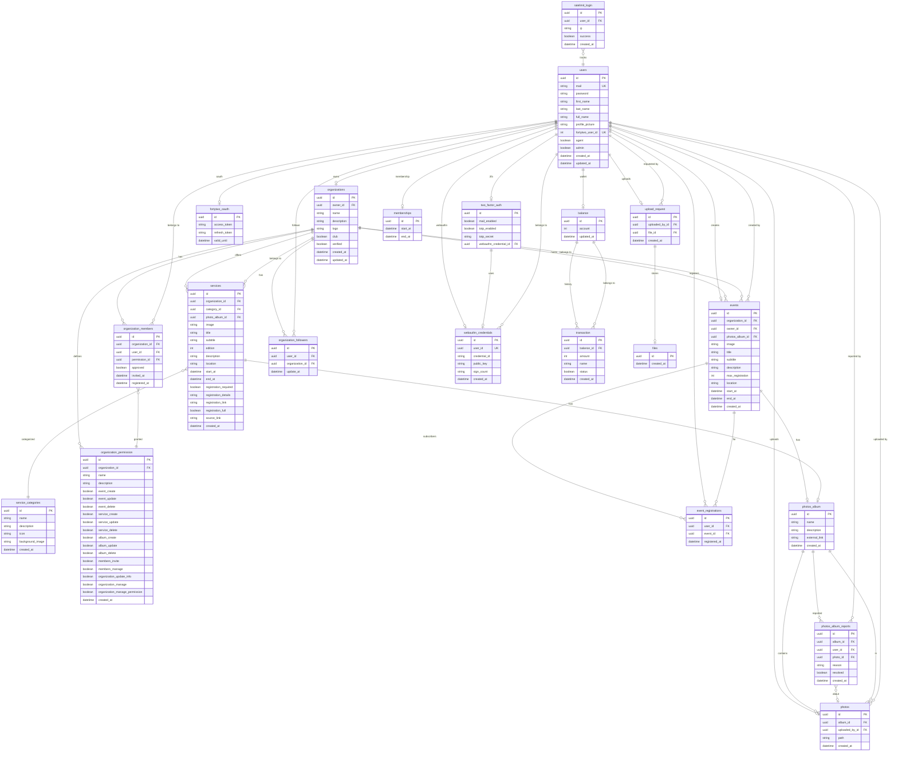

> 
>
> This project has been created as part of the 42 curriculum by [rgodet](https://profile.intra.42.fr/users/rgodet), [amblanch](https://profile.intra.42.fr/users/amblanch), [mdegache](https://profile.intra.42.fr/users/mdegache), [tcybak](https://profile.intra.42.fr/users/tcybak), and [adeboose](https://profile.intra.42.fr/users/adeboose).

 

  
  <h1 align="center">ft_transcendence</h1>

 

## 📝 Description
This project is a website for the association BDE 42 Angoulême. This website is aimed to manage events, services, and clubs.

## 🚀 Getting started

## 👥 Team

## 🗂️ Project Management

### Organization

Work was distributed by category and difficulty. As the most experienced web developer, Rémy could reassign or pick up tasks from other members when needed.
There were no formal meetings — all discussions happened in person at 42.

### Tools

- **Linear** — issue tracking, task prioritization, and sprint planning
- **GitHub** — code hosting, pull requests, and code reviews
- **Discord** — dedicated server for async communication

### Code Review & Branch Strategy

- One branch per Linear issue, merged into `main` via pull request
- **2 approvals minimum** required before merge
- Direct pushes to `main` are blocked and cannot be bypassed
- **Prettier** formatting is enforced on all code
- All commits must follow [Conventional Commits](https://www.conventionalcommits.org/)

## ⚡️ Technical Stack

## 🗄️ Database Schema

## ✨Features List

## ☑️ Modules

## 🤡 Individual Contributions

| Member | Role | Commits | PRs merged |
|--------|------|---------|------------|
| [Rémy Godet](https://profile.intra.42.fr/users/rgodet) | Product Owner | 266 | 13 |
| [Amaury Blanchet](https://profile.intra.42.fr/users/amblanch) | Tech Lead | 223 | 5 |
| [Manuarii Degache](https://profile.intra.42.fr/users/mdegache) | Developer | 44 | 2 |
| [Timothy Cybak](https://profile.intra.42.fr/users/tcybak) | Developer | 54 | 0 |
| [Aubin de Boose](https://profile.intra.42.fr/users/adeboose) | DevOps | 47 | 0 |

### [Rémy Godet](https://profile.intra.42.fr/users/rgodet) — Product Owner

**266 commits** · 13 PRs merged

Rémy acted as Product Owner and lead frontend developer. He drove the project vision, managed the overall architecture, and delivered the majority of the UI:
- **Frontend architecture:** layout, routing, home page, login flows, profile, privacy & terms pages
- **Component library:** Sidebar, OrganizationDashboardTable, MembershipCard, Toast provider, filter system
- **UI/UX:** SCSS design system, loading skeletons, empty states, modals, stickers
- **Auth & session:** 42 OAuth proxy, user context, session management, error handling
- **Database layer:** initial Prisma models, User utilities, OrganizationMembers

### [Amaury Blanchet](https://profile.intra.42.fr/users/amblanch) — Tech Lead

**223 commits** · 5 PRs merged

Amaury served as Tech Lead, owning the backend and data layer of the application:
- **Backend API:** events CRUD, organization CRUD, user routes, agent approval, search & filtering
- **Database:** Prisma schema design, migrations, generated models, Event & Organization data layer
- **Feature development:** event management (creation, subscription, image upload, import/export), organization follow/members system
- **API testing:** comprehensive Bruno API collection for all endpoints
- **Infrastructure:** Docker Node/Nginx setup, PostgreSQL configuration

### [Manuarii Degache](https://profile.intra.42.fr/users/mdegache) — Developer

**44 commits** · 2 PRs merged

Manuarii focused on authentication flows and user-facing features:
- **Auth system:** agent signup, forgot-password flow with email verification, password reset
- **Email service:** reusable sendEmail utility for password recovery
- **User management:** account creation, user API routes, permission schemas
- **Organization features:** member invites, follower system, organization members API
- **Frontend:** signup pages, forgot-password UI, confirmation code input

### [Timothy Cybak](https://profile.intra.42.fr/users/tcybak) — Developer

**54 commits**

Timothy specialized in frontend UI components and user experience:
- **UI components:** Carousel, Calendar, EventPreview, SectionHeaderTitle, ModificationText
- **Pages:** events list, membership, privacy, account settings, 2FA login
- **Login flows:** forgot password page, reset password component, signup templates
- **PWA:** Progressive Web App setup with manifest, icons, and service worker
- **Sumup component:** reusable summary/reload component

### [Aubin de Boose](https://profile.intra.42.fr/users/adeboose) — DevOps

**47 commits**

Aubin owned the entire infrastructure and deployment pipeline:
- **Docker:** dev/prod Docker Compose files, Dockerfiles for Node, Nginx, Elasticsearch
- **ELK Stack:** Elasticsearch, Logstash, Kibana setup with certs, dashboards, and index templates
- **Monitoring:** Prometheus + Grafana dashboards for infrastructure overview
- **Security:** Vault agent, mTLS, ModSecurity WAF, SSL in dev mode
- **CI/CD:** GitHub Actions workflows, commitlint, Husky hooks, Makefile
- **Reverse proxy:** Nginx config with subdomain routing, default_server blocks

## 📚 Resources